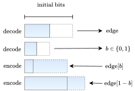

# Random Edge Coding: One-Shot Bits-Back Coding of Large Labeled Graphs [](https://arxiv.org/abs/2305.09705)

🎉 Accepted to ICML 2023 🎉


<p align="justify">
We present a one-shot method for compressing large labeled graphs called Random Edge Coding. When paired with a parameter-free model based on Pólya’s Urn, the worst-case computational and memory complexities scale quasi-linearly and linearly with the number of observed edges, making it efficient on sparse graphs, and requires only integer arithmetic. Key to our method is bits-back coding, which is used to sample edges and vertices without replacement from the graph’s edge-list in a way that preserves the structure of the network. Optimality is proven under a class of random graph models that are invariant to permutations of the edges and of vertices within an edge. Experiments indicate Random Edge Coding can achieve competitive compression performance on real-world network datasets and scales to graphs with millions of nodes and edges.
</p>

# How to use Random Edge Coding
```python
import craystack as cs
import numpy as np

from rec.definitions import Graph
from rec.models import PolyasUrnModel

def sample_erdos_renyi_graph(num_nodes, p, seed=0):
    np.random.seed(seed)
    adjacency_matrix = np.triu(np.random.rand(num_nodes, num_nodes) < p, k=1)
    edge_array = np.stack(np.nonzero(adjacency_matrix)).T
    return Graph(
        edge_array=edge_array,
        num_nodes=num_nodes,
        num_edges=edge_array.shape[0],
    )

# Sample a graph from the G(n, p) model of Erdős and Rényi.
num_nodes = 200
p_erdos_renyi = 1/2
graph = sample_erdos_renyi_graph(num_nodes, p_erdos_renyi)

# Compute the information content of the vertex-sequence and graph
# under Pólya's Urn model, normalized by the number of observed edges
# in the graph. The information content is equal to the negative log-likelihood
# and is the optimal number of bits an algorithm should allocate under the model
# to minimize the average number of bits.
#
# Note the information content of the vertex-sequence is significantly larger
# than that of the graph, as it contains the order in which edges were added
# to the graph. With Random Edge Coding this redundancy is removed, providing
# a substantial bit saving.
model = PolyasUrnModel(graph.num_nodes, graph.num_edges, bias=1)
seq_bpe, graph_bpe = model.compute_bpe(graph)

# Initialize the ANS state, encode the graph, and compute the final message
# length. We add 32 extra bits to represent the integer needed to specify the
# number of observed edges.
ans_state = cs.rans.base_message(shape=(1,))
ans_state = model.push(ans_state, graph)
rec_bpe = (32 + 32*len(cs.flatten(ans_state)))/graph.num_edges

# Decode the graph and assert the graph is recovered losslessly.
ans_state, graph_decoded = model.pop(ans_state)
assert graph_decoded == graph
```

# Run Experiments
You can run all experiments with this notebook: [](https://colab.research.google.com/github/dsevero/Random-Edge-Coding/blob/main/Random_Edge_Coding.ipynb)

# How to cite
```
@misc{severo2023random,
    title={Random Edge Coding: One-Shot Bits-Back Coding of Large Labeled Graphs},
    author={Daniel Severo and James Townsend and Ashish Khisti and Alireza Makhzani},
    year={2023},
    eprint={2305.09705},
    archivePrefix={arXiv},
    primaryClass={cs.LG}
}
```
